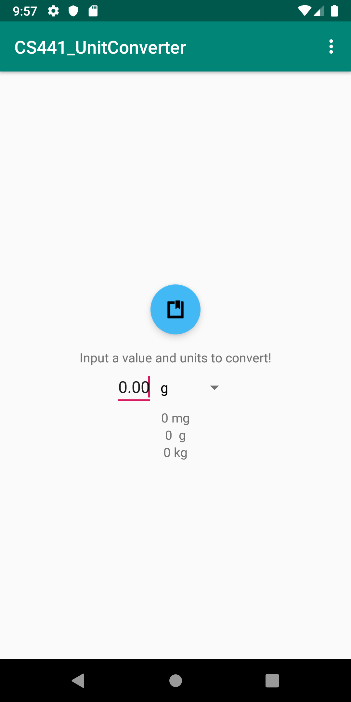
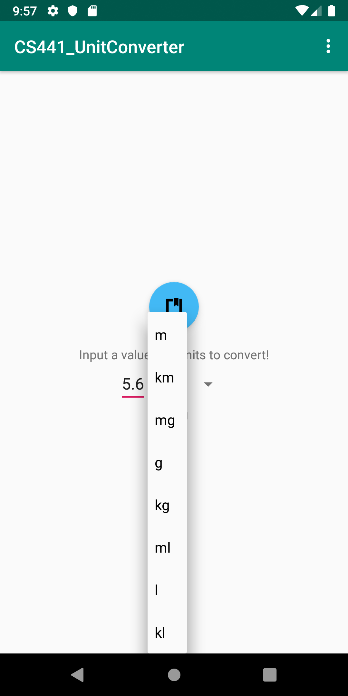
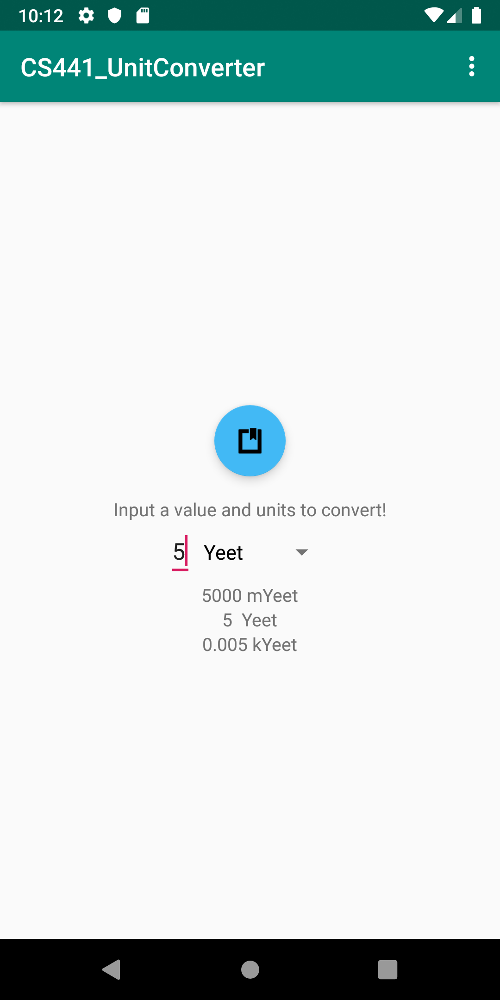

# CS441_UnitConverter

This is my first project for CS441 - Game  Development for Mobile Platforms.
The goal of this project is to create a simple unit converter app for Android.

## Inputs
The app accepts a double input to represent the value to be converted to other units. This is done with an EditText widget with the inputType flag set to numberDecimal to make it easier for the user to input numbers and more difficult to input non-numeric characters. The input unit can be selected from the spinner directly to the right of the numeric input. The available units are specified in a string array located in strings.xml. These units can be milli, standard, or kilos of the base unit. Ex: mg, g, kg, ml, l, kl, mYeet, Yeet, kYeet. Placing this string array in strings.xml makes it very easy to add any other units.

## Making the conversion
Once inputs have been given, pressing the blue button with the black logo will do the unit conversion. The three rows below the inputs will change to represent the input value converted to mUnits, Units, and kUnits. These conversions are done simultaneously and the rows are populated based on the input unit. Ex: if the input unit is kYeet, the three rows will be in mYeet, Yeet, and kYeet.

## App Screenshots
App default opening

Selecting an input unit

Output after conversion

## Production Log
**8/30/19:** Began project, created nested linearlayouts to make formatting relevant elements very easy. Learned about giving ids to widgets in xml so they can be accessed in the java code.

**8/31/19-9/3/19:** Took off for Labor Day weekend, no work done.

**9/4/19:** Created the spinner to act as a selector for the input units. Required a spinneradapter and creating a string array in strings.xml

**9/5/19:** In java, wrote code to convert units from input to various outputs

**9/6/19:** Changed the way the output table is populated. Removed code that just displayed an output three times in different ways, and implemented a solution that iterates over the output table.

**9/7/19:** Moved code describing the floating action button into content_main.xml so that it could be placed inside a linearlayout and easily positioned relative to the other used elements. Also changed the button's color and logo

**9/8/19:** Code cleanup. Hardcoded strings were moved into strings.xml so they could be referenced in other xml locations. Also improved unit parsing so that units with lengths of more than one characters could be used. Proved this by adding mYeet, Yeet, and kYeet as units.
